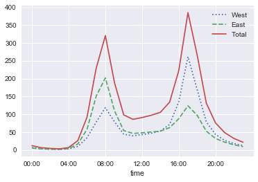

```python
%matplotlib inline
import pandas as pd
import seaborn; seaborn.set()
import matplotlib.pyplot as plt
import numpy as np
```

### 观察数据特征
1. 数据索引为时间(按小时计)
2. 单位时间东西道驶入自行车数量
3. 数据包含53280行，其中53271行有值
4. 时间跨度从2012年10月到2018年10月
5. 平均每天驶入自行车57(东)，54(西)辆


```python
data = pd.read_csv('FremontBridge.csv', index_col='Date', parse_dates=True)
data.head()
```


<div>
<style scoped>
    .dataframe tbody tr th:only-of-type {
        vertical-align: middle;
    }

    .dataframe tbody tr th {
        vertical-align: top;
    }

    .dataframe thead th {
        text-align: right;
    }
</style>
<table border="1" class="dataframe">
  <thead>
    <tr style="text-align: right;">
      <th></th>
      <th>Fremont Bridge East Sidewalk</th>
      <th>Fremont Bridge West Sidewalk</th>
    </tr>
    <tr>
      <th>Date</th>
      <th></th>
      <th></th>
    </tr>
  </thead>
  <tbody>
    <tr>
      <th>2012-10-03 00:00:00</th>
      <td>9.0</td>
      <td>4.0</td>
    </tr>
    <tr>
      <th>2012-10-03 01:00:00</th>
      <td>6.0</td>
      <td>4.0</td>
    </tr>
    <tr>
      <th>2012-10-03 02:00:00</th>
      <td>1.0</td>
      <td>1.0</td>
    </tr>
    <tr>
      <th>2012-10-03 03:00:00</th>
      <td>3.0</td>
      <td>2.0</td>
    </tr>
    <tr>
      <th>2012-10-03 04:00:00</th>
      <td>1.0</td>
      <td>6.0</td>
    </tr>
  </tbody>
</table>
</div>


```python
data.info()
```

    <class 'pandas.core.frame.DataFrame'>
    DatetimeIndex: 53280 entries, 2012-10-03 00:00:00 to 2018-10-31 23:00:00
    Data columns (total 2 columns):
    Fremont Bridge East Sidewalk    53271 non-null float64
    Fremont Bridge West Sidewalk    53271 non-null float64
    dtypes: float64(2)
    memory usage: 1.2 MB
    


```python
data.dropna().describe()
```


<div>
<style scoped>
    .dataframe tbody tr th:only-of-type {
        vertical-align: middle;
    }

    .dataframe tbody tr th {
        vertical-align: top;
    }

    .dataframe thead th {
        text-align: right;
    }
</style>
<table border="1" class="dataframe">
  <thead>
    <tr style="text-align: right;">
      <th></th>
      <th>Fremont Bridge East Sidewalk</th>
      <th>Fremont Bridge West Sidewalk</th>
    </tr>
  </thead>
  <tbody>
    <tr>
      <th>count</th>
      <td>53271.000000</td>
      <td>53271.000000</td>
    </tr>
    <tr>
      <th>mean</th>
      <td>57.434401</td>
      <td>54.368549</td>
    </tr>
    <tr>
      <th>std</th>
      <td>82.795998</td>
      <td>71.282743</td>
    </tr>
    <tr>
      <th>min</th>
      <td>0.000000</td>
      <td>0.000000</td>
    </tr>
    <tr>
      <th>25%</th>
      <td>7.000000</td>
      <td>7.000000</td>
    </tr>
    <tr>
      <th>50%</th>
      <td>29.000000</td>
      <td>30.000000</td>
    </tr>
    <tr>
      <th>75%</th>
      <td>70.000000</td>
      <td>72.000000</td>
    </tr>
    <tr>
      <th>max</th>
      <td>717.000000</td>
      <td>698.000000</td>
    </tr>
  </tbody>
</table>
</div>


### 驶入自行车数与时间的关系
1. 可观察到每年年末车最少
2. 夏季自行车数量最多
3. 由东边驶入的自行车总体更多
4. 2017年后，自行车驶入数量增加


```python
data.columns = ['West', 'East']
data['Total'] = data.eval('West + East')
data.plot(figsize = (16,9),alpha = 0.3)
plt.ylabel('Hourly Bicycle Count');
```


```python
daily = data.resample('D').sum()
daily.rolling(50, center=True,
              win_type='gaussian').sum(std=10).plot(style=[':', '--', '-']);
```


### 进一步观察按每小时统计的自行车数量
1. 车流量最多的时间集中在8点及17点，这与上下班时间吻合
2. 从东西路口驶入车辆峰值也刚好相反，东口上午高，西口下午高

### 类似的，按星期进一步观察自行车数量
1. 工作日自行车数量较多，周末较少，说明大部分骑车的人都是用来上班的
2. 工作日、周末各时间段驶入自行车数量差异明显


```python
by_hour = data.groupby(data.index.time).mean()
hourly_ticks = 4 * 60 * 60 * np.arange(6)
by_hour.plot(xticks=hourly_ticks, style=[':', '--', '-']);
```





```python
by_weekday = pd.DataFrame(data.groupby(data.index.dayofweek).mean())
fig = plt.figure()
ax = fig.add_subplot(1,1,1)
by_weekday.plot(ax = ax,style=[':', '--', '-'],)
by_weekday.index = ['Mon', 'Tues', 'Wed', 'Thurs', 'Fri', 'Sat', 'Sun']
ax.set_xticklabels(['','Mon', 'Tues', 'Wed', 'Thurs', 'Fri', 'Sat', 'Sun'])
```


    [Text(0,0,''),
     Text(0,0,'Mon'),
     Text(0,0,'Tues'),
     Text(0,0,'Wed'),
     Text(0,0,'Thurs'),
     Text(0,0,'Fri'),
     Text(0,0,'Sat'),
     Text(0,0,'Sun')]


```python
weekend = np.where(data.index.weekday < 5, 'Weekday', 'Weekend')
by_time = data.groupby([weekend, data.index.time]).mean()

fig, ax = plt.subplots(1, 2, figsize=(14, 5))
by_time.loc['Weekday'].plot(ax=ax[0], title='Weekdays',
                           xticks=hourly_ticks, style=[':', '--', '-'])
by_time.loc['Weekend'].plot(ax=ax[1], title='Weekends',
                           xticks=hourly_ticks, style=[':', '--', '-'])
```


    <matplotlib.axes._subplots.AxesSubplot at 0x279d0c860f0>


### 导入当地天气数据
1. 导入当地天气数据集,进一步查看天气因素与自行车数量的关系
2. 查看天气信息，可以看到是按日计量，包括了1340条数据，特征包括温度、降雨量等


```python
counts = pd.read_csv('FremontBridge.csv', index_col='Date', parse_dates=True)
weather = pd.read_csv('BicycleWeather.csv', index_col='DATE', parse_dates=True)
```


```python
weather.info()
```

    <class 'pandas.core.frame.DataFrame'>
    DatetimeIndex: 2250 entries, 2012-10-03 to 2018-11-30
    Data columns (total 23 columns):
    STATION    2250 non-null object
    NAME       2250 non-null object
    AWND       2249 non-null float64
    PRCP       2250 non-null float64
    SNOW       2249 non-null float64
    SNWD       2250 non-null float64
    TMAX       2250 non-null int64
    TMIN       2250 non-null int64
    WDF2       2249 non-null float64
    WDF5       2229 non-null float64
    WSF2       2249 non-null float64
    WSF5       2229 non-null float64
    WT01       962 non-null float64
    WT02       109 non-null float64
    WT03       17 non-null float64
    WT04       2 non-null float64
    WT05       3 non-null float64
    WT08       64 non-null float64
    WT13       104 non-null float64
    WT14       19 non-null float64
    WT16       129 non-null float64
    WT18       6 non-null float64
    WT22       9 non-null float64
    dtypes: float64(19), int64(2), object(2)
    memory usage: 421.9+ KB
    


```python
weather 
```


<div>
<style scoped>
    .dataframe tbody tr th:only-of-type {
        vertical-align: middle;
    }

    .dataframe tbody tr th {
        vertical-align: top;
    }

    .dataframe thead th {
        text-align: right;
    }
</style>
<table border="1" class="dataframe">
  <thead>
    <tr style="text-align: right;">
      <th></th>
      <th>STATION</th>
      <th>NAME</th>
      <th>AWND</th>
      <th>PRCP</th>
      <th>SNOW</th>
      <th>SNWD</th>
      <th>TMAX</th>
      <th>TMIN</th>
      <th>WDF2</th>
      <th>WDF5</th>
      <th>...</th>
      <th>WT02</th>
      <th>WT03</th>
      <th>WT04</th>
      <th>WT05</th>
      <th>WT08</th>
      <th>WT13</th>
      <th>WT14</th>
      <th>WT16</th>
      <th>WT18</th>
      <th>WT22</th>
    </tr>
    <tr>
      <th>DATE</th>
      <th></th>
      <th></th>
      <th></th>
      <th></th>
      <th></th>
      <th></th>
      <th></th>
      <th></th>
      <th></th>
      <th></th>
      <th></th>
      <th></th>
      <th></th>
      <th></th>
      <th></th>
      <th></th>
      <th></th>
      <th></th>
      <th></th>
      <th></th>
      <th></th>
    </tr>
  </thead>
  <tbody>
    <tr>
      <th>2012-10-03</th>
      <td>USW00024233</td>
      <td>SEATTLE TACOMA INTERNATIONAL AIRPORT, WA US</td>
      <td>16.33</td>
      <td>0.00</td>
      <td>0.0</td>
      <td>0.0</td>
      <td>66</td>
      <td>46</td>
      <td>10.0</td>
      <td>20.0</td>
      <td>...</td>
      <td>NaN</td>
      <td>NaN</td>
      <td>NaN</td>
      <td>NaN</td>
      <td>NaN</td>
      <td>NaN</td>
      <td>NaN</td>
      <td>NaN</td>
      <td>NaN</td>
      <td>NaN</td>
    </tr>
    <tr>
      <th>2012-10-04</th>
      <td>USW00024233</td>
      <td>SEATTLE TACOMA INTERNATIONAL AIRPORT, WA US</td>
      <td>14.54</td>
      <td>0.00</td>
      <td>0.0</td>
      <td>0.0</td>
      <td>66</td>
      <td>47</td>
      <td>20.0</td>
      <td>20.0</td>
      <td>...</td>
      <td>NaN</td>
      <td>NaN</td>
      <td>NaN</td>
      <td>NaN</td>
      <td>NaN</td>
      <td>NaN</td>
      <td>NaN</td>
      <td>NaN</td>
      <td>NaN</td>
      <td>NaN</td>
    </tr>
    <tr>
      <th>2012-10-05</th>
      <td>USW00024233</td>
      <td>SEATTLE TACOMA INTERNATIONAL AIRPORT, WA US</td>
      <td>12.75</td>
      <td>0.00</td>
      <td>0.0</td>
      <td>0.0</td>
      <td>71</td>
      <td>48</td>
      <td>360.0</td>
      <td>360.0</td>
      <td>...</td>
      <td>NaN</td>
      <td>NaN</td>
      <td>NaN</td>
      <td>NaN</td>
      <td>NaN</td>
      <td>NaN</td>
      <td>NaN</td>
      <td>NaN</td>
      <td>NaN</td>
      <td>NaN</td>
    </tr>
    <tr>
      <th>2012-10-06</th>
      <td>USW00024233</td>
      <td>SEATTLE TACOMA INTERNATIONAL AIRPORT, WA US</td>
      <td>11.41</td>
      <td>0.00</td>
      <td>0.0</td>
      <td>0.0</td>
      <td>75</td>
      <td>46</td>
      <td>20.0</td>
      <td>20.0</td>
      <td>...</td>
      <td>NaN</td>
      <td>NaN</td>
      <td>NaN</td>
      <td>NaN</td>
      <td>NaN</td>
      <td>NaN</td>
      <td>NaN</td>
      <td>NaN</td>
      <td>NaN</td>
      <td>NaN</td>
    </tr>
    <tr>
      <th>2012-10-07</th>
      <td>USW00024233</td>
      <td>SEATTLE TACOMA INTERNATIONAL AIRPORT, WA US</td>
      <td>2.91</td>
      <td>0.00</td>
      <td>0.0</td>
      <td>0.0</td>
      <td>75</td>
      <td>46</td>
      <td>30.0</td>
      <td>10.0</td>
      <td>...</td>
      <td>NaN</td>
      <td>NaN</td>
      <td>NaN</td>
      <td>NaN</td>
      <td>NaN</td>
      <td>NaN</td>
      <td>NaN</td>
      <td>NaN</td>
      <td>NaN</td>
      <td>NaN</td>
    </tr>
    <tr>
      <th>2012-10-08</th>
      <td>USW00024233</td>
      <td>SEATTLE TACOMA INTERNATIONAL AIRPORT, WA US</td>
      <td>4.25</td>
      <td>0.00</td>
      <td>0.0</td>
      <td>0.0</td>
      <td>70</td>
      <td>46</td>
      <td>210.0</td>
      <td>230.0</td>
      <td>...</td>
      <td>NaN</td>
      <td>NaN</td>
      <td>NaN</td>
      <td>NaN</td>
      <td>NaN</td>
      <td>NaN</td>
      <td>NaN</td>
      <td>NaN</td>
      <td>NaN</td>
      <td>NaN</td>
    </tr>
    <tr>
      <th>2012-10-09</th>
      <td>USW00024233</td>
      <td>SEATTLE TACOMA INTERNATIONAL AIRPORT, WA US</td>
      <td>3.58</td>
      <td>0.00</td>
      <td>0.0</td>
      <td>0.0</td>
      <td>61</td>
      <td>48</td>
      <td>170.0</td>
      <td>170.0</td>
      <td>...</td>
      <td>NaN</td>
      <td>NaN</td>
      <td>NaN</td>
      <td>NaN</td>
      <td>NaN</td>
      <td>1.0</td>
      <td>NaN</td>
      <td>NaN</td>
      <td>NaN</td>
      <td>NaN</td>
    </tr>
    <tr>
      <th>2012-10-10</th>
      <td>USW00024233</td>
      <td>SEATTLE TACOMA INTERNATIONAL AIRPORT, WA US</td>
      <td>3.13</td>
      <td>0.00</td>
      <td>0.0</td>
      <td>0.0</td>
      <td>54</td>
      <td>47</td>
      <td>40.0</td>
      <td>40.0</td>
      <td>...</td>
      <td>1.0</td>
      <td>NaN</td>
      <td>NaN</td>
      <td>NaN</td>
      <td>1.0</td>
      <td>1.0</td>
      <td>NaN</td>
      <td>NaN</td>
      <td>NaN</td>
      <td>NaN</td>
    </tr>
    <tr>
      <th>2012-10-11</th>
      <td>USW00024233</td>
      <td>SEATTLE TACOMA INTERNATIONAL AIRPORT, WA US</td>
      <td>2.91</td>
      <td>0.00</td>
      <td>0.0</td>
      <td>0.0</td>
      <td>57</td>
      <td>45</td>
      <td>270.0</td>
      <td>60.0</td>
      <td>...</td>
      <td>NaN</td>
      <td>NaN</td>
      <td>NaN</td>
      <td>NaN</td>
      <td>1.0</td>
      <td>1.0</td>
      <td>NaN</td>
      <td>NaN</td>
      <td>NaN</td>
      <td>NaN</td>
    </tr>
    <tr>
      <th>2012-10-12</th>
      <td>USW00024233</td>
      <td>SEATTLE TACOMA INTERNATIONAL AIRPORT, WA US</td>
      <td>10.29</td>
      <td>0.08</td>
      <td>0.0</td>
      <td>0.0</td>
      <td>57</td>
      <td>48</td>
      <td>220.0</td>
      <td>230.0</td>
      <td>...</td>
      <td>NaN</td>
      <td>NaN</td>
      <td>NaN</td>
      <td>NaN</td>
      <td>NaN</td>
      <td>1.0</td>
      <td>NaN</td>
      <td>1.0</td>
      <td>NaN</td>
      <td>NaN</td>
    </tr>
    <tr>
      <th>2012-10-13</th>
      <td>USW00024233</td>
      <td>SEATTLE TACOMA INTERNATIONAL AIRPORT, WA US</td>
      <td>8.72</td>
      <td>0.19</td>
      <td>0.0</td>
      <td>0.0</td>
      <td>60</td>
      <td>54</td>
      <td>190.0</td>
      <td>190.0</td>
      <td>...</td>
      <td>NaN</td>
      <td>NaN</td>
      <td>NaN</td>
      <td>NaN</td>
      <td>NaN</td>
      <td>1.0</td>
      <td>NaN</td>
      <td>1.0</td>
      <td>NaN</td>
      <td>NaN</td>
    </tr>
    <tr>
      <th>2012-10-14</th>
      <td>USW00024233</td>
      <td>SEATTLE TACOMA INTERNATIONAL AIRPORT, WA US</td>
      <td>7.61</td>
      <td>0.65</td>
      <td>0.0</td>
      <td>0.0</td>
      <td>64</td>
      <td>56</td>
      <td>160.0</td>
      <td>200.0</td>
      <td>...</td>
      <td>NaN</td>
      <td>NaN</td>
      <td>NaN</td>
      <td>NaN</td>
      <td>NaN</td>
      <td>1.0</td>
      <td>NaN</td>
      <td>1.0</td>
      <td>NaN</td>
      <td>NaN</td>
    </tr>
    <tr>
      <th>2012-10-15</th>
      <td>USW00024233</td>
      <td>SEATTLE TACOMA INTERNATIONAL AIRPORT, WA US</td>
      <td>10.29</td>
      <td>0.31</td>
      <td>0.0</td>
      <td>0.0</td>
      <td>63</td>
      <td>52</td>
      <td>210.0</td>
      <td>210.0</td>
      <td>...</td>
      <td>NaN</td>
      <td>NaN</td>
      <td>NaN</td>
      <td>NaN</td>
      <td>NaN</td>
      <td>1.0</td>
      <td>NaN</td>
      <td>1.0</td>
      <td>NaN</td>
      <td>NaN</td>
    </tr>
    <tr>
      <th>2012-10-16</th>
      <td>USW00024233</td>
      <td>SEATTLE TACOMA INTERNATIONAL AIRPORT, WA US</td>
      <td>12.30</td>
      <td>0.00</td>
      <td>0.0</td>
      <td>0.0</td>
      <td>61</td>
      <td>47</td>
      <td>200.0</td>
      <td>200.0</td>
      <td>...</td>
      <td>NaN</td>
      <td>NaN</td>
      <td>NaN</td>
      <td>NaN</td>
      <td>NaN</td>
      <td>NaN</td>
      <td>NaN</td>
      <td>NaN</td>
      <td>NaN</td>
      <td>NaN</td>
    </tr>
    <tr>
      <th>2012-10-17</th>
      <td>USW00024233</td>
      <td>SEATTLE TACOMA INTERNATIONAL AIRPORT, WA US</td>
      <td>3.58</td>
      <td>0.00</td>
      <td>0.0</td>
      <td>0.0</td>
      <td>58</td>
      <td>43</td>
      <td>280.0</td>
      <td>290.0</td>
      <td>...</td>
      <td>NaN</td>
      <td>NaN</td>
      <td>NaN</td>
      <td>NaN</td>
      <td>NaN</td>
      <td>NaN</td>
      <td>NaN</td>
      <td>NaN</td>
      <td>NaN</td>
      <td>NaN</td>
    </tr>
    <tr>
      <th>2012-10-18</th>
      <td>USW00024233</td>
      <td>SEATTLE TACOMA INTERNATIONAL AIRPORT, WA US</td>
      <td>4.47</td>
      <td>0.82</td>
      <td>0.0</td>
      <td>0.0</td>
      <td>64</td>
      <td>44</td>
      <td>240.0</td>
      <td>240.0</td>
      <td>...</td>
      <td>NaN</td>
      <td>NaN</td>
      <td>NaN</td>
      <td>NaN</td>
      <td>NaN</td>
      <td>1.0</td>
      <td>NaN</td>
      <td>1.0</td>
      <td>NaN</td>
      <td>NaN</td>
    </tr>
    <tr>
      <th>2012-10-19</th>
      <td>USW00024233</td>
      <td>SEATTLE TACOMA INTERNATIONAL AIRPORT, WA US</td>
      <td>11.86</td>
      <td>0.19</td>
      <td>0.0</td>
      <td>0.0</td>
      <td>59</td>
      <td>49</td>
      <td>170.0</td>
      <td>170.0</td>
      <td>...</td>
      <td>NaN</td>
      <td>NaN</td>
      <td>NaN</td>
      <td>NaN</td>
      <td>NaN</td>
      <td>1.0</td>
      <td>1.0</td>
      <td>1.0</td>
      <td>NaN</td>
      <td>NaN</td>
    </tr>
    <tr>
      <th>2012-10-20</th>
      <td>USW00024233</td>
      <td>SEATTLE TACOMA INTERNATIONAL AIRPORT, WA US</td>
      <td>12.75</td>
      <td>0.02</td>
      <td>0.0</td>
      <td>0.0</td>
      <td>52</td>
      <td>43</td>
      <td>290.0</td>
      <td>290.0</td>
      <td>...</td>
      <td>NaN</td>
      <td>NaN</td>
      <td>NaN</td>
      <td>NaN</td>
      <td>NaN</td>
      <td>NaN</td>
      <td>NaN</td>
      <td>1.0</td>
      <td>NaN</td>
      <td>NaN</td>
    </tr>
    <tr>
      <th>2012-10-21</th>
      <td>USW00024233</td>
      <td>SEATTLE TACOMA INTERNATIONAL AIRPORT, WA US</td>
      <td>6.04</td>
      <td>0.25</td>
      <td>0.0</td>
      <td>0.0</td>
      <td>53</td>
      <td>40</td>
      <td>160.0</td>
      <td>160.0</td>
      <td>...</td>
      <td>NaN</td>
      <td>NaN</td>
      <td>NaN</td>
      <td>NaN</td>
      <td>NaN</td>
      <td>1.0</td>
      <td>NaN</td>
      <td>1.0</td>
      <td>NaN</td>
      <td>NaN</td>
    </tr>
    <tr>
      <th>2012-10-22</th>
      <td>USW00024233</td>
      <td>SEATTLE TACOMA INTERNATIONAL AIRPORT, WA US</td>
      <td>5.82</td>
      <td>0.35</td>
      <td>0.0</td>
      <td>0.0</td>
      <td>46</td>
      <td>38</td>
      <td>20.0</td>
      <td>20.0</td>
      <td>...</td>
      <td>NaN</td>
      <td>NaN</td>
      <td>NaN</td>
      <td>NaN</td>
      <td>NaN</td>
      <td>1.0</td>
      <td>NaN</td>
      <td>1.0</td>
      <td>NaN</td>
      <td>NaN</td>
    </tr>
    <tr>
      <th>2012-10-23</th>
      <td>USW00024233</td>
      <td>SEATTLE TACOMA INTERNATIONAL AIRPORT, WA US</td>
      <td>6.71</td>
      <td>0.00</td>
      <td>0.0</td>
      <td>0.0</td>
      <td>52</td>
      <td>42</td>
      <td>210.0</td>
      <td>210.0</td>
      <td>...</td>
      <td>NaN</td>
      <td>NaN</td>
      <td>NaN</td>
      <td>NaN</td>
      <td>NaN</td>
      <td>NaN</td>
      <td>NaN</td>
      <td>1.0</td>
      <td>NaN</td>
      <td>NaN</td>
    </tr>
    <tr>
      <th>2012-10-24</th>
      <td>USW00024233</td>
      <td>SEATTLE TACOMA INTERNATIONAL AIRPORT, WA US</td>
      <td>4.70</td>
      <td>0.28</td>
      <td>0.0</td>
      <td>0.0</td>
      <td>53</td>
      <td>43</td>
      <td>260.0</td>
      <td>260.0</td>
      <td>...</td>
      <td>NaN</td>
      <td>NaN</td>
      <td>NaN</td>
      <td>NaN</td>
      <td>NaN</td>
      <td>1.0</td>
      <td>NaN</td>
      <td>1.0</td>
      <td>NaN</td>
      <td>NaN</td>
    </tr>
    <tr>
      <th>2012-10-25</th>
      <td>USW00024233</td>
      <td>SEATTLE TACOMA INTERNATIONAL AIRPORT, WA US</td>
      <td>3.36</td>
      <td>0.00</td>
      <td>0.0</td>
      <td>0.0</td>
      <td>53</td>
      <td>44</td>
      <td>110.0</td>
      <td>110.0</td>
      <td>...</td>
      <td>NaN</td>
      <td>NaN</td>
      <td>NaN</td>
      <td>NaN</td>
      <td>NaN</td>
      <td>NaN</td>
      <td>NaN</td>
      <td>NaN</td>
      <td>NaN</td>
      <td>NaN</td>
    </tr>
    <tr>
      <th>2012-10-26</th>
      <td>USW00024233</td>
      <td>SEATTLE TACOMA INTERNATIONAL AIRPORT, WA US</td>
      <td>5.59</td>
      <td>0.06</td>
      <td>0.0</td>
      <td>0.0</td>
      <td>52</td>
      <td>45</td>
      <td>210.0</td>
      <td>200.0</td>
      <td>...</td>
      <td>NaN</td>
      <td>NaN</td>
      <td>NaN</td>
      <td>NaN</td>
      <td>NaN</td>
      <td>1.0</td>
      <td>NaN</td>
      <td>1.0</td>
      <td>NaN</td>
      <td>NaN</td>
    </tr>
    <tr>
      <th>2012-10-27</th>
      <td>USW00024233</td>
      <td>SEATTLE TACOMA INTERNATIONAL AIRPORT, WA US</td>
      <td>11.41</td>
      <td>0.91</td>
      <td>0.0</td>
      <td>0.0</td>
      <td>58</td>
      <td>49</td>
      <td>190.0</td>
      <td>210.0</td>
      <td>...</td>
      <td>NaN</td>
      <td>NaN</td>
      <td>NaN</td>
      <td>NaN</td>
      <td>NaN</td>
      <td>1.0</td>
      <td>NaN</td>
      <td>1.0</td>
      <td>NaN</td>
      <td>NaN</td>
    </tr>
    <tr>
      <th>2012-10-28</th>
      <td>USW00024233</td>
      <td>SEATTLE TACOMA INTERNATIONAL AIRPORT, WA US</td>
      <td>8.50</td>
      <td>0.24</td>
      <td>0.0</td>
      <td>0.0</td>
      <td>58</td>
      <td>50</td>
      <td>210.0</td>
      <td>210.0</td>
      <td>...</td>
      <td>NaN</td>
      <td>NaN</td>
      <td>NaN</td>
      <td>NaN</td>
      <td>NaN</td>
      <td>1.0</td>
      <td>NaN</td>
      <td>1.0</td>
      <td>NaN</td>
      <td>NaN</td>
    </tr>
    <tr>
      <th>2012-10-29</th>
      <td>USW00024233</td>
      <td>SEATTLE TACOMA INTERNATIONAL AIRPORT, WA US</td>
      <td>10.96</td>
      <td>0.43</td>
      <td>0.0</td>
      <td>0.0</td>
      <td>60</td>
      <td>50</td>
      <td>200.0</td>
      <td>210.0</td>
      <td>...</td>
      <td>NaN</td>
      <td>NaN</td>
      <td>NaN</td>
      <td>NaN</td>
      <td>NaN</td>
      <td>1.0</td>
      <td>NaN</td>
      <td>1.0</td>
      <td>NaN</td>
      <td>NaN</td>
    </tr>
    <tr>
      <th>2012-10-30</th>
      <td>USW00024233</td>
      <td>SEATTLE TACOMA INTERNATIONAL AIRPORT, WA US</td>
      <td>6.26</td>
      <td>1.36</td>
      <td>0.0</td>
      <td>0.0</td>
      <td>59</td>
      <td>54</td>
      <td>160.0</td>
      <td>140.0</td>
      <td>...</td>
      <td>NaN</td>
      <td>NaN</td>
      <td>NaN</td>
      <td>NaN</td>
      <td>NaN</td>
      <td>1.0</td>
      <td>NaN</td>
      <td>1.0</td>
      <td>NaN</td>
      <td>NaN</td>
    </tr>
    <tr>
      <th>2012-10-31</th>
      <td>USW00024233</td>
      <td>SEATTLE TACOMA INTERNATIONAL AIRPORT, WA US</td>
      <td>6.04</td>
      <td>0.57</td>
      <td>0.0</td>
      <td>0.0</td>
      <td>60</td>
      <td>52</td>
      <td>170.0</td>
      <td>170.0</td>
      <td>...</td>
      <td>NaN</td>
      <td>NaN</td>
      <td>NaN</td>
      <td>NaN</td>
      <td>NaN</td>
      <td>1.0</td>
      <td>NaN</td>
      <td>1.0</td>
      <td>NaN</td>
      <td>NaN</td>
    </tr>
    <tr>
      <th>2012-11-01</th>
      <td>USW00024233</td>
      <td>SEATTLE TACOMA INTERNATIONAL AIRPORT, WA US</td>
      <td>6.71</td>
      <td>0.38</td>
      <td>0.0</td>
      <td>0.0</td>
      <td>59</td>
      <td>51</td>
      <td>160.0</td>
      <td>150.0</td>
      <td>...</td>
      <td>NaN</td>
      <td>NaN</td>
      <td>NaN</td>
      <td>NaN</td>
      <td>NaN</td>
      <td>1.0</td>
      <td>NaN</td>
      <td>1.0</td>
      <td>NaN</td>
      <td>NaN</td>
    </tr>
    <tr>
      <th>...</th>
      <td>...</td>
      <td>...</td>
      <td>...</td>
      <td>...</td>
      <td>...</td>
      <td>...</td>
      <td>...</td>
      <td>...</td>
      <td>...</td>
      <td>...</td>
      <td>...</td>
      <td>...</td>
      <td>...</td>
      <td>...</td>
      <td>...</td>
      <td>...</td>
      <td>...</td>
      <td>...</td>
      <td>...</td>
      <td>...</td>
      <td>...</td>
    </tr>
    <tr>
      <th>2018-11-01</th>
      <td>USW00024233</td>
      <td>SEATTLE TACOMA INTERNATIONAL AIRPORT, WA US</td>
      <td>14.09</td>
      <td>0.04</td>
      <td>0.0</td>
      <td>0.0</td>
      <td>62</td>
      <td>57</td>
      <td>210.0</td>
      <td>210.0</td>
      <td>...</td>
      <td>NaN</td>
      <td>NaN</td>
      <td>NaN</td>
      <td>NaN</td>
      <td>NaN</td>
      <td>NaN</td>
      <td>NaN</td>
      <td>NaN</td>
      <td>NaN</td>
      <td>NaN</td>
    </tr>
    <tr>
      <th>2018-11-02</th>
      <td>USW00024233</td>
      <td>SEATTLE TACOMA INTERNATIONAL AIRPORT, WA US</td>
      <td>14.09</td>
      <td>0.30</td>
      <td>0.0</td>
      <td>0.0</td>
      <td>62</td>
      <td>54</td>
      <td>190.0</td>
      <td>190.0</td>
      <td>...</td>
      <td>NaN</td>
      <td>NaN</td>
      <td>NaN</td>
      <td>NaN</td>
      <td>NaN</td>
      <td>NaN</td>
      <td>NaN</td>
      <td>NaN</td>
      <td>NaN</td>
      <td>NaN</td>
    </tr>
    <tr>
      <th>2018-11-03</th>
      <td>USW00024233</td>
      <td>SEATTLE TACOMA INTERNATIONAL AIRPORT, WA US</td>
      <td>12.30</td>
      <td>0.18</td>
      <td>0.0</td>
      <td>0.0</td>
      <td>55</td>
      <td>53</td>
      <td>170.0</td>
      <td>180.0</td>
      <td>...</td>
      <td>NaN</td>
      <td>NaN</td>
      <td>NaN</td>
      <td>NaN</td>
      <td>NaN</td>
      <td>NaN</td>
      <td>NaN</td>
      <td>NaN</td>
      <td>NaN</td>
      <td>NaN</td>
    </tr>
    <tr>
      <th>2018-11-04</th>
      <td>USW00024233</td>
      <td>SEATTLE TACOMA INTERNATIONAL AIRPORT, WA US</td>
      <td>12.75</td>
      <td>0.03</td>
      <td>0.0</td>
      <td>0.0</td>
      <td>61</td>
      <td>52</td>
      <td>200.0</td>
      <td>210.0</td>
      <td>...</td>
      <td>NaN</td>
      <td>NaN</td>
      <td>NaN</td>
      <td>NaN</td>
      <td>NaN</td>
      <td>NaN</td>
      <td>NaN</td>
      <td>NaN</td>
      <td>NaN</td>
      <td>NaN</td>
    </tr>
    <tr>
      <th>2018-11-05</th>
      <td>USW00024233</td>
      <td>SEATTLE TACOMA INTERNATIONAL AIRPORT, WA US</td>
      <td>10.96</td>
      <td>0.00</td>
      <td>0.0</td>
      <td>0.0</td>
      <td>56</td>
      <td>48</td>
      <td>220.0</td>
      <td>220.0</td>
      <td>...</td>
      <td>NaN</td>
      <td>NaN</td>
      <td>NaN</td>
      <td>NaN</td>
      <td>NaN</td>
      <td>NaN</td>
      <td>NaN</td>
      <td>NaN</td>
      <td>NaN</td>
      <td>NaN</td>
    </tr>
    <tr>
      <th>2018-11-06</th>
      <td>USW00024233</td>
      <td>SEATTLE TACOMA INTERNATIONAL AIRPORT, WA US</td>
      <td>6.93</td>
      <td>0.05</td>
      <td>0.0</td>
      <td>0.0</td>
      <td>56</td>
      <td>46</td>
      <td>90.0</td>
      <td>70.0</td>
      <td>...</td>
      <td>NaN</td>
      <td>NaN</td>
      <td>NaN</td>
      <td>NaN</td>
      <td>NaN</td>
      <td>NaN</td>
      <td>NaN</td>
      <td>NaN</td>
      <td>NaN</td>
      <td>NaN</td>
    </tr>
    <tr>
      <th>2018-11-07</th>
      <td>USW00024233</td>
      <td>SEATTLE TACOMA INTERNATIONAL AIRPORT, WA US</td>
      <td>5.82</td>
      <td>0.04</td>
      <td>0.0</td>
      <td>0.0</td>
      <td>53</td>
      <td>40</td>
      <td>360.0</td>
      <td>360.0</td>
      <td>...</td>
      <td>NaN</td>
      <td>NaN</td>
      <td>NaN</td>
      <td>NaN</td>
      <td>NaN</td>
      <td>NaN</td>
      <td>NaN</td>
      <td>NaN</td>
      <td>NaN</td>
      <td>NaN</td>
    </tr>
    <tr>
      <th>2018-11-08</th>
      <td>USW00024233</td>
      <td>SEATTLE TACOMA INTERNATIONAL AIRPORT, WA US</td>
      <td>4.25</td>
      <td>0.00</td>
      <td>0.0</td>
      <td>0.0</td>
      <td>50</td>
      <td>36</td>
      <td>30.0</td>
      <td>360.0</td>
      <td>...</td>
      <td>NaN</td>
      <td>NaN</td>
      <td>NaN</td>
      <td>NaN</td>
      <td>NaN</td>
      <td>NaN</td>
      <td>NaN</td>
      <td>NaN</td>
      <td>NaN</td>
      <td>NaN</td>
    </tr>
    <tr>
      <th>2018-11-09</th>
      <td>USW00024233</td>
      <td>SEATTLE TACOMA INTERNATIONAL AIRPORT, WA US</td>
      <td>3.58</td>
      <td>0.07</td>
      <td>0.0</td>
      <td>0.0</td>
      <td>43</td>
      <td>35</td>
      <td>130.0</td>
      <td>120.0</td>
      <td>...</td>
      <td>NaN</td>
      <td>NaN</td>
      <td>NaN</td>
      <td>NaN</td>
      <td>NaN</td>
      <td>NaN</td>
      <td>NaN</td>
      <td>NaN</td>
      <td>NaN</td>
      <td>NaN</td>
    </tr>
    <tr>
      <th>2018-11-10</th>
      <td>USW00024233</td>
      <td>SEATTLE TACOMA INTERNATIONAL AIRPORT, WA US</td>
      <td>6.93</td>
      <td>0.00</td>
      <td>0.0</td>
      <td>0.0</td>
      <td>50</td>
      <td>40</td>
      <td>30.0</td>
      <td>10.0</td>
      <td>...</td>
      <td>1.0</td>
      <td>NaN</td>
      <td>NaN</td>
      <td>NaN</td>
      <td>NaN</td>
      <td>NaN</td>
      <td>NaN</td>
      <td>NaN</td>
      <td>NaN</td>
      <td>NaN</td>
    </tr>
    <tr>
      <th>2018-11-11</th>
      <td>USW00024233</td>
      <td>SEATTLE TACOMA INTERNATIONAL AIRPORT, WA US</td>
      <td>9.40</td>
      <td>0.00</td>
      <td>0.0</td>
      <td>0.0</td>
      <td>50</td>
      <td>34</td>
      <td>10.0</td>
      <td>10.0</td>
      <td>...</td>
      <td>1.0</td>
      <td>NaN</td>
      <td>NaN</td>
      <td>NaN</td>
      <td>NaN</td>
      <td>NaN</td>
      <td>NaN</td>
      <td>NaN</td>
      <td>NaN</td>
      <td>NaN</td>
    </tr>
    <tr>
      <th>2018-11-12</th>
      <td>USW00024233</td>
      <td>SEATTLE TACOMA INTERNATIONAL AIRPORT, WA US</td>
      <td>8.72</td>
      <td>0.00</td>
      <td>0.0</td>
      <td>0.0</td>
      <td>61</td>
      <td>41</td>
      <td>120.0</td>
      <td>120.0</td>
      <td>...</td>
      <td>NaN</td>
      <td>NaN</td>
      <td>NaN</td>
      <td>NaN</td>
      <td>NaN</td>
      <td>NaN</td>
      <td>NaN</td>
      <td>NaN</td>
      <td>NaN</td>
      <td>NaN</td>
    </tr>
    <tr>
      <th>2018-11-13</th>
      <td>USW00024233</td>
      <td>SEATTLE TACOMA INTERNATIONAL AIRPORT, WA US</td>
      <td>6.49</td>
      <td>0.00</td>
      <td>0.0</td>
      <td>0.0</td>
      <td>54</td>
      <td>39</td>
      <td>180.0</td>
      <td>180.0</td>
      <td>...</td>
      <td>NaN</td>
      <td>NaN</td>
      <td>NaN</td>
      <td>NaN</td>
      <td>NaN</td>
      <td>NaN</td>
      <td>NaN</td>
      <td>NaN</td>
      <td>NaN</td>
      <td>NaN</td>
    </tr>
    <tr>
      <th>2018-11-14</th>
      <td>USW00024233</td>
      <td>SEATTLE TACOMA INTERNATIONAL AIRPORT, WA US</td>
      <td>9.62</td>
      <td>0.11</td>
      <td>0.0</td>
      <td>0.0</td>
      <td>57</td>
      <td>46</td>
      <td>190.0</td>
      <td>200.0</td>
      <td>...</td>
      <td>NaN</td>
      <td>NaN</td>
      <td>NaN</td>
      <td>NaN</td>
      <td>NaN</td>
      <td>NaN</td>
      <td>NaN</td>
      <td>NaN</td>
      <td>NaN</td>
      <td>NaN</td>
    </tr>
    <tr>
      <th>2018-11-15</th>
      <td>USW00024233</td>
      <td>SEATTLE TACOMA INTERNATIONAL AIRPORT, WA US</td>
      <td>7.38</td>
      <td>0.02</td>
      <td>0.0</td>
      <td>0.0</td>
      <td>55</td>
      <td>49</td>
      <td>190.0</td>
      <td>190.0</td>
      <td>...</td>
      <td>NaN</td>
      <td>NaN</td>
      <td>NaN</td>
      <td>NaN</td>
      <td>NaN</td>
      <td>NaN</td>
      <td>NaN</td>
      <td>NaN</td>
      <td>NaN</td>
      <td>NaN</td>
    </tr>
    <tr>
      <th>2018-11-16</th>
      <td>USW00024233</td>
      <td>SEATTLE TACOMA INTERNATIONAL AIRPORT, WA US</td>
      <td>10.07</td>
      <td>0.03</td>
      <td>0.0</td>
      <td>0.0</td>
      <td>55</td>
      <td>46</td>
      <td>10.0</td>
      <td>10.0</td>
      <td>...</td>
      <td>1.0</td>
      <td>NaN</td>
      <td>NaN</td>
      <td>NaN</td>
      <td>NaN</td>
      <td>NaN</td>
      <td>NaN</td>
      <td>NaN</td>
      <td>NaN</td>
      <td>NaN</td>
    </tr>
    <tr>
      <th>2018-11-17</th>
      <td>USW00024233</td>
      <td>SEATTLE TACOMA INTERNATIONAL AIRPORT, WA US</td>
      <td>13.20</td>
      <td>0.00</td>
      <td>0.0</td>
      <td>0.0</td>
      <td>55</td>
      <td>41</td>
      <td>10.0</td>
      <td>360.0</td>
      <td>...</td>
      <td>NaN</td>
      <td>NaN</td>
      <td>NaN</td>
      <td>NaN</td>
      <td>NaN</td>
      <td>NaN</td>
      <td>NaN</td>
      <td>NaN</td>
      <td>NaN</td>
      <td>NaN</td>
    </tr>
    <tr>
      <th>2018-11-18</th>
      <td>USW00024233</td>
      <td>SEATTLE TACOMA INTERNATIONAL AIRPORT, WA US</td>
      <td>6.93</td>
      <td>0.00</td>
      <td>0.0</td>
      <td>0.0</td>
      <td>55</td>
      <td>38</td>
      <td>30.0</td>
      <td>20.0</td>
      <td>...</td>
      <td>NaN</td>
      <td>NaN</td>
      <td>NaN</td>
      <td>NaN</td>
      <td>NaN</td>
      <td>NaN</td>
      <td>NaN</td>
      <td>NaN</td>
      <td>NaN</td>
      <td>NaN</td>
    </tr>
    <tr>
      <th>2018-11-19</th>
      <td>USW00024233</td>
      <td>SEATTLE TACOMA INTERNATIONAL AIRPORT, WA US</td>
      <td>2.46</td>
      <td>0.00</td>
      <td>0.0</td>
      <td>0.0</td>
      <td>54</td>
      <td>34</td>
      <td>150.0</td>
      <td>20.0</td>
      <td>...</td>
      <td>NaN</td>
      <td>NaN</td>
      <td>NaN</td>
      <td>NaN</td>
      <td>NaN</td>
      <td>NaN</td>
      <td>NaN</td>
      <td>NaN</td>
      <td>NaN</td>
      <td>NaN</td>
    </tr>
    <tr>
      <th>2018-11-20</th>
      <td>USW00024233</td>
      <td>SEATTLE TACOMA INTERNATIONAL AIRPORT, WA US</td>
      <td>3.58</td>
      <td>0.00</td>
      <td>0.0</td>
      <td>0.0</td>
      <td>55</td>
      <td>34</td>
      <td>140.0</td>
      <td>140.0</td>
      <td>...</td>
      <td>1.0</td>
      <td>NaN</td>
      <td>NaN</td>
      <td>NaN</td>
      <td>NaN</td>
      <td>NaN</td>
      <td>NaN</td>
      <td>NaN</td>
      <td>NaN</td>
      <td>NaN</td>
    </tr>
    <tr>
      <th>2018-11-21</th>
      <td>USW00024233</td>
      <td>SEATTLE TACOMA INTERNATIONAL AIRPORT, WA US</td>
      <td>4.70</td>
      <td>0.11</td>
      <td>0.0</td>
      <td>0.0</td>
      <td>53</td>
      <td>47</td>
      <td>90.0</td>
      <td>90.0</td>
      <td>...</td>
      <td>NaN</td>
      <td>NaN</td>
      <td>NaN</td>
      <td>NaN</td>
      <td>NaN</td>
      <td>NaN</td>
      <td>NaN</td>
      <td>NaN</td>
      <td>NaN</td>
      <td>NaN</td>
    </tr>
    <tr>
      <th>2018-11-22</th>
      <td>USW00024233</td>
      <td>SEATTLE TACOMA INTERNATIONAL AIRPORT, WA US</td>
      <td>10.51</td>
      <td>0.48</td>
      <td>0.0</td>
      <td>0.0</td>
      <td>52</td>
      <td>45</td>
      <td>190.0</td>
      <td>180.0</td>
      <td>...</td>
      <td>NaN</td>
      <td>NaN</td>
      <td>NaN</td>
      <td>NaN</td>
      <td>NaN</td>
      <td>NaN</td>
      <td>NaN</td>
      <td>NaN</td>
      <td>NaN</td>
      <td>NaN</td>
    </tr>
    <tr>
      <th>2018-11-23</th>
      <td>USW00024233</td>
      <td>SEATTLE TACOMA INTERNATIONAL AIRPORT, WA US</td>
      <td>8.72</td>
      <td>0.34</td>
      <td>0.0</td>
      <td>0.0</td>
      <td>49</td>
      <td>42</td>
      <td>190.0</td>
      <td>190.0</td>
      <td>...</td>
      <td>NaN</td>
      <td>NaN</td>
      <td>NaN</td>
      <td>NaN</td>
      <td>1.0</td>
      <td>NaN</td>
      <td>NaN</td>
      <td>NaN</td>
      <td>NaN</td>
      <td>NaN</td>
    </tr>
    <tr>
      <th>2018-11-24</th>
      <td>USW00024233</td>
      <td>SEATTLE TACOMA INTERNATIONAL AIRPORT, WA US</td>
      <td>4.92</td>
      <td>0.00</td>
      <td>0.0</td>
      <td>0.0</td>
      <td>49</td>
      <td>38</td>
      <td>110.0</td>
      <td>60.0</td>
      <td>...</td>
      <td>NaN</td>
      <td>NaN</td>
      <td>NaN</td>
      <td>NaN</td>
      <td>NaN</td>
      <td>NaN</td>
      <td>NaN</td>
      <td>NaN</td>
      <td>NaN</td>
      <td>NaN</td>
    </tr>
    <tr>
      <th>2018-11-25</th>
      <td>USW00024233</td>
      <td>SEATTLE TACOMA INTERNATIONAL AIRPORT, WA US</td>
      <td>2.91</td>
      <td>0.01</td>
      <td>0.0</td>
      <td>0.0</td>
      <td>48</td>
      <td>36</td>
      <td>110.0</td>
      <td>120.0</td>
      <td>...</td>
      <td>NaN</td>
      <td>NaN</td>
      <td>NaN</td>
      <td>NaN</td>
      <td>NaN</td>
      <td>NaN</td>
      <td>NaN</td>
      <td>NaN</td>
      <td>NaN</td>
      <td>NaN</td>
    </tr>
    <tr>
      <th>2018-11-26</th>
      <td>USW00024233</td>
      <td>SEATTLE TACOMA INTERNATIONAL AIRPORT, WA US</td>
      <td>7.83</td>
      <td>1.42</td>
      <td>0.0</td>
      <td>0.0</td>
      <td>57</td>
      <td>45</td>
      <td>140.0</td>
      <td>160.0</td>
      <td>...</td>
      <td>NaN</td>
      <td>NaN</td>
      <td>NaN</td>
      <td>NaN</td>
      <td>NaN</td>
      <td>NaN</td>
      <td>NaN</td>
      <td>NaN</td>
      <td>NaN</td>
      <td>NaN</td>
    </tr>
    <tr>
      <th>2018-11-27</th>
      <td>USW00024233</td>
      <td>SEATTLE TACOMA INTERNATIONAL AIRPORT, WA US</td>
      <td>11.63</td>
      <td>1.84</td>
      <td>0.0</td>
      <td>0.0</td>
      <td>58</td>
      <td>48</td>
      <td>170.0</td>
      <td>190.0</td>
      <td>...</td>
      <td>NaN</td>
      <td>1.0</td>
      <td>1.0</td>
      <td>NaN</td>
      <td>NaN</td>
      <td>NaN</td>
      <td>NaN</td>
      <td>NaN</td>
      <td>NaN</td>
      <td>NaN</td>
    </tr>
    <tr>
      <th>2018-11-28</th>
      <td>USW00024233</td>
      <td>SEATTLE TACOMA INTERNATIONAL AIRPORT, WA US</td>
      <td>6.26</td>
      <td>0.16</td>
      <td>0.0</td>
      <td>0.0</td>
      <td>51</td>
      <td>47</td>
      <td>190.0</td>
      <td>190.0</td>
      <td>...</td>
      <td>NaN</td>
      <td>NaN</td>
      <td>NaN</td>
      <td>NaN</td>
      <td>NaN</td>
      <td>NaN</td>
      <td>NaN</td>
      <td>NaN</td>
      <td>NaN</td>
      <td>NaN</td>
    </tr>
    <tr>
      <th>2018-11-29</th>
      <td>USW00024233</td>
      <td>SEATTLE TACOMA INTERNATIONAL AIRPORT, WA US</td>
      <td>8.05</td>
      <td>0.00</td>
      <td>0.0</td>
      <td>0.0</td>
      <td>50</td>
      <td>43</td>
      <td>10.0</td>
      <td>10.0</td>
      <td>...</td>
      <td>NaN</td>
      <td>NaN</td>
      <td>NaN</td>
      <td>NaN</td>
      <td>NaN</td>
      <td>NaN</td>
      <td>NaN</td>
      <td>NaN</td>
      <td>NaN</td>
      <td>NaN</td>
    </tr>
    <tr>
      <th>2018-11-30</th>
      <td>USW00024233</td>
      <td>SEATTLE TACOMA INTERNATIONAL AIRPORT, WA US</td>
      <td>NaN</td>
      <td>0.19</td>
      <td>0.0</td>
      <td>0.0</td>
      <td>50</td>
      <td>43</td>
      <td>NaN</td>
      <td>NaN</td>
      <td>...</td>
      <td>NaN</td>
      <td>NaN</td>
      <td>NaN</td>
      <td>NaN</td>
      <td>NaN</td>
      <td>NaN</td>
      <td>NaN</td>
      <td>NaN</td>
      <td>NaN</td>
      <td>NaN</td>
    </tr>
  </tbody>
</table>
<p>2250 rows × 23 columns</p>
</div>


### 特征工程
1. 将温度转化为摄氏度
2. 增加晴雨特征
3. 由于之前可以看出自行车驶入量与年周期相关性很大，增加以年为周期，按日增加的时间特征
4. 冬夏有着不同的日照长短，引入白昼时间特征
5. 节假日车流量不同，引入节假日


```python
def hours_of_daylight(date, axis=23.44, latitude=47.61):
    days = (date - pd.datetime(2000, 12, 21)).days
    m = (1. - np.tan(np.radians(latitude))
         * np.tan(np.radians(axis) * np.cos(days * 2 * np.pi / 365.25)))
    return 24. * np.degrees(np.arccos(1 - np.clip(m, 0, 2))) / 180.

daily['daylight_hrs'] = list(map(hours_of_daylight, daily.index))
daily[['daylight_hrs']].plot()
plt.ylim(8, 17)
```


    (8, 17)


```python
daily = counts.resample('d').sum()
daily['Total'] = daily.sum(axis=1)
daily = daily[['Total']] 
days = ['Mon', 'Tue', 'Wed', 'Thu', 'Fri', 'Sat', 'Sun']
for i in range(7):
    daily[days[i]] = (daily.index.dayofweek == i).astype(float)
```


```python
weather['TMIN'] /= 10
weather['TMAX'] /= 10
weather['Temp (C)'] = 0.5 * (weather['TMIN'] + weather['TMAX'])

# precip is in 1/10 mm; convert to inches
weather['PRCP'] /= 254
weather['dry day'] = (weather['PRCP'] == 0).astype(int)

daily = daily.join(weather[['PRCP', 'Temp (C)', 'dry day']])
```


```python
from pandas.tseries.holiday import USFederalHolidayCalendar
cal = USFederalHolidayCalendar()
holidays = cal.holidays('2012', '2019')
daily = daily.join(pd.Series(1, index=holidays, name='holiday'))
daily['holiday'].fillna(0, inplace=True)
```


```python
daily['annual'] = (daily.index - daily.index[0]).days / 365
```


```python
dailyi
```


<div>
<style scoped>
    .dataframe tbody tr th:only-of-type {
        vertical-align: middle;
    }

    .dataframe tbody tr th {
        vertical-align: top;
    }

    .dataframe thead th {
        text-align: right;
    }
</style>
<table border="1" class="dataframe">
  <thead>
    <tr style="text-align: right;">
      <th></th>
      <th>Total</th>
      <th>Mon</th>
      <th>Tue</th>
      <th>Wed</th>
      <th>Thu</th>
      <th>Fri</th>
      <th>Sat</th>
      <th>Sun</th>
      <th>PRCP</th>
      <th>Temp (C)</th>
      <th>dry day</th>
      <th>holiday</th>
      <th>annual</th>
      <th>daylight_hrs</th>
    </tr>
    <tr>
      <th>Date</th>
      <th></th>
      <th></th>
      <th></th>
      <th></th>
      <th></th>
      <th></th>
      <th></th>
      <th></th>
      <th></th>
      <th></th>
      <th></th>
      <th></th>
      <th></th>
      <th></th>
    </tr>
  </thead>
  <tbody>
    <tr>
      <th>2012-10-03</th>
      <td>3521.0</td>
      <td>0.0</td>
      <td>0.0</td>
      <td>1.0</td>
      <td>0.0</td>
      <td>0.0</td>
      <td>0.0</td>
      <td>0.0</td>
      <td>0.000000</td>
      <td>5.60</td>
      <td>1</td>
      <td>0.0</td>
      <td>0.000000</td>
      <td>11.277359</td>
    </tr>
    <tr>
      <th>2012-10-04</th>
      <td>3475.0</td>
      <td>0.0</td>
      <td>0.0</td>
      <td>0.0</td>
      <td>1.0</td>
      <td>0.0</td>
      <td>0.0</td>
      <td>0.0</td>
      <td>0.000000</td>
      <td>5.65</td>
      <td>1</td>
      <td>0.0</td>
      <td>0.002740</td>
      <td>11.219142</td>
    </tr>
    <tr>
      <th>2012-10-05</th>
      <td>3148.0</td>
      <td>0.0</td>
      <td>0.0</td>
      <td>0.0</td>
      <td>0.0</td>
      <td>1.0</td>
      <td>0.0</td>
      <td>0.0</td>
      <td>0.000000</td>
      <td>5.95</td>
      <td>1</td>
      <td>0.0</td>
      <td>0.005479</td>
      <td>11.161038</td>
    </tr>
    <tr>
      <th>2012-10-06</th>
      <td>2006.0</td>
      <td>0.0</td>
      <td>0.0</td>
      <td>0.0</td>
      <td>0.0</td>
      <td>0.0</td>
      <td>1.0</td>
      <td>0.0</td>
      <td>0.000000</td>
      <td>6.05</td>
      <td>1</td>
      <td>0.0</td>
      <td>0.008219</td>
      <td>11.103056</td>
    </tr>
    <tr>
      <th>2012-10-07</th>
      <td>2142.0</td>
      <td>0.0</td>
      <td>0.0</td>
      <td>0.0</td>
      <td>0.0</td>
      <td>0.0</td>
      <td>0.0</td>
      <td>1.0</td>
      <td>0.000000</td>
      <td>6.05</td>
      <td>1</td>
      <td>0.0</td>
      <td>0.010959</td>
      <td>11.045208</td>
    </tr>
    <tr>
      <th>2012-10-08</th>
      <td>3537.0</td>
      <td>1.0</td>
      <td>0.0</td>
      <td>0.0</td>
      <td>0.0</td>
      <td>0.0</td>
      <td>0.0</td>
      <td>0.0</td>
      <td>0.000000</td>
      <td>5.80</td>
      <td>1</td>
      <td>1.0</td>
      <td>0.013699</td>
      <td>10.987503</td>
    </tr>
    <tr>
      <th>2012-10-09</th>
      <td>3501.0</td>
      <td>0.0</td>
      <td>1.0</td>
      <td>0.0</td>
      <td>0.0</td>
      <td>0.0</td>
      <td>0.0</td>
      <td>0.0</td>
      <td>0.000000</td>
      <td>5.45</td>
      <td>1</td>
      <td>0.0</td>
      <td>0.016438</td>
      <td>10.929950</td>
    </tr>
    <tr>
      <th>2012-10-10</th>
      <td>3235.0</td>
      <td>0.0</td>
      <td>0.0</td>
      <td>1.0</td>
      <td>0.0</td>
      <td>0.0</td>
      <td>0.0</td>
      <td>0.0</td>
      <td>0.000000</td>
      <td>5.05</td>
      <td>1</td>
      <td>0.0</td>
      <td>0.019178</td>
      <td>10.872560</td>
    </tr>
    <tr>
      <th>2012-10-11</th>
      <td>3047.0</td>
      <td>0.0</td>
      <td>0.0</td>
      <td>0.0</td>
      <td>1.0</td>
      <td>0.0</td>
      <td>0.0</td>
      <td>0.0</td>
      <td>0.000000</td>
      <td>5.10</td>
      <td>1</td>
      <td>0.0</td>
      <td>0.021918</td>
      <td>10.815345</td>
    </tr>
    <tr>
      <th>2012-10-12</th>
      <td>2011.0</td>
      <td>0.0</td>
      <td>0.0</td>
      <td>0.0</td>
      <td>0.0</td>
      <td>1.0</td>
      <td>0.0</td>
      <td>0.0</td>
      <td>0.000315</td>
      <td>5.25</td>
      <td>0</td>
      <td>0.0</td>
      <td>0.024658</td>
      <td>10.758314</td>
    </tr>
    <tr>
      <th>2012-10-13</th>
      <td>766.0</td>
      <td>0.0</td>
      <td>0.0</td>
      <td>0.0</td>
      <td>0.0</td>
      <td>0.0</td>
      <td>1.0</td>
      <td>0.0</td>
      <td>0.000748</td>
      <td>5.70</td>
      <td>0</td>
      <td>0.0</td>
      <td>0.027397</td>
      <td>10.701479</td>
    </tr>
    <tr>
      <th>2012-10-14</th>
      <td>698.0</td>
      <td>0.0</td>
      <td>0.0</td>
      <td>0.0</td>
      <td>0.0</td>
      <td>0.0</td>
      <td>0.0</td>
      <td>1.0</td>
      <td>0.002559</td>
      <td>6.00</td>
      <td>0</td>
      <td>0.0</td>
      <td>0.030137</td>
      <td>10.644852</td>
    </tr>
    <tr>
      <th>2012-10-15</th>
      <td>2273.0</td>
      <td>1.0</td>
      <td>0.0</td>
      <td>0.0</td>
      <td>0.0</td>
      <td>0.0</td>
      <td>0.0</td>
      <td>0.0</td>
      <td>0.001220</td>
      <td>5.75</td>
      <td>0</td>
      <td>0.0</td>
      <td>0.032877</td>
      <td>10.588444</td>
    </tr>
    <tr>
      <th>2012-10-16</th>
      <td>3036.0</td>
      <td>0.0</td>
      <td>1.0</td>
      <td>0.0</td>
      <td>0.0</td>
      <td>0.0</td>
      <td>0.0</td>
      <td>0.0</td>
      <td>0.000000</td>
      <td>5.40</td>
      <td>1</td>
      <td>0.0</td>
      <td>0.035616</td>
      <td>10.532267</td>
    </tr>
    <tr>
      <th>2012-10-17</th>
      <td>3243.0</td>
      <td>0.0</td>
      <td>0.0</td>
      <td>1.0</td>
      <td>0.0</td>
      <td>0.0</td>
      <td>0.0</td>
      <td>0.0</td>
      <td>0.000000</td>
      <td>5.05</td>
      <td>1</td>
      <td>0.0</td>
      <td>0.038356</td>
      <td>10.476334</td>
    </tr>
    <tr>
      <th>2012-10-18</th>
      <td>2923.0</td>
      <td>0.0</td>
      <td>0.0</td>
      <td>0.0</td>
      <td>1.0</td>
      <td>0.0</td>
      <td>0.0</td>
      <td>0.0</td>
      <td>0.003228</td>
      <td>5.40</td>
      <td>0</td>
      <td>0.0</td>
      <td>0.041096</td>
      <td>10.420659</td>
    </tr>
    <tr>
      <th>2012-10-19</th>
      <td>1977.0</td>
      <td>0.0</td>
      <td>0.0</td>
      <td>0.0</td>
      <td>0.0</td>
      <td>1.0</td>
      <td>0.0</td>
      <td>0.0</td>
      <td>0.000748</td>
      <td>5.40</td>
      <td>0</td>
      <td>0.0</td>
      <td>0.043836</td>
      <td>10.365253</td>
    </tr>
    <tr>
      <th>2012-10-20</th>
      <td>1068.0</td>
      <td>0.0</td>
      <td>0.0</td>
      <td>0.0</td>
      <td>0.0</td>
      <td>0.0</td>
      <td>1.0</td>
      <td>0.0</td>
      <td>0.000079</td>
      <td>4.75</td>
      <td>0</td>
      <td>0.0</td>
      <td>0.046575</td>
      <td>10.310130</td>
    </tr>
    <tr>
      <th>2012-10-21</th>
      <td>989.0</td>
      <td>0.0</td>
      <td>0.0</td>
      <td>0.0</td>
      <td>0.0</td>
      <td>0.0</td>
      <td>0.0</td>
      <td>1.0</td>
      <td>0.000984</td>
      <td>4.65</td>
      <td>0</td>
      <td>0.0</td>
      <td>0.049315</td>
      <td>10.255305</td>
    </tr>
    <tr>
      <th>2012-10-22</th>
      <td>2129.0</td>
      <td>1.0</td>
      <td>0.0</td>
      <td>0.0</td>
      <td>0.0</td>
      <td>0.0</td>
      <td>0.0</td>
      <td>0.0</td>
      <td>0.001378</td>
      <td>4.20</td>
      <td>0</td>
      <td>0.0</td>
      <td>0.052055</td>
      <td>10.200791</td>
    </tr>
    <tr>
      <th>2012-10-23</th>
      <td>2500.0</td>
      <td>0.0</td>
      <td>1.0</td>
      <td>0.0</td>
      <td>0.0</td>
      <td>0.0</td>
      <td>0.0</td>
      <td>0.0</td>
      <td>0.000000</td>
      <td>4.70</td>
      <td>1</td>
      <td>0.0</td>
      <td>0.054795</td>
      <td>10.146603</td>
    </tr>
    <tr>
      <th>2012-10-24</th>
      <td>2429.0</td>
      <td>0.0</td>
      <td>0.0</td>
      <td>1.0</td>
      <td>0.0</td>
      <td>0.0</td>
      <td>0.0</td>
      <td>0.0</td>
      <td>0.001102</td>
      <td>4.80</td>
      <td>0</td>
      <td>0.0</td>
      <td>0.057534</td>
      <td>10.092757</td>
    </tr>
    <tr>
      <th>2012-10-25</th>
      <td>2713.0</td>
      <td>0.0</td>
      <td>0.0</td>
      <td>0.0</td>
      <td>1.0</td>
      <td>0.0</td>
      <td>0.0</td>
      <td>0.0</td>
      <td>0.000000</td>
      <td>4.85</td>
      <td>1</td>
      <td>0.0</td>
      <td>0.060274</td>
      <td>10.039267</td>
    </tr>
    <tr>
      <th>2012-10-26</th>
      <td>2073.0</td>
      <td>0.0</td>
      <td>0.0</td>
      <td>0.0</td>
      <td>0.0</td>
      <td>1.0</td>
      <td>0.0</td>
      <td>0.0</td>
      <td>0.000236</td>
      <td>4.85</td>
      <td>0</td>
      <td>0.0</td>
      <td>0.063014</td>
      <td>9.986149</td>
    </tr>
    <tr>
      <th>2012-10-27</th>
      <td>531.0</td>
      <td>0.0</td>
      <td>0.0</td>
      <td>0.0</td>
      <td>0.0</td>
      <td>0.0</td>
      <td>1.0</td>
      <td>0.0</td>
      <td>0.003583</td>
      <td>5.35</td>
      <td>0</td>
      <td>0.0</td>
      <td>0.065753</td>
      <td>9.933420</td>
    </tr>
    <tr>
      <th>2012-10-28</th>
      <td>1062.0</td>
      <td>0.0</td>
      <td>0.0</td>
      <td>0.0</td>
      <td>0.0</td>
      <td>0.0</td>
      <td>0.0</td>
      <td>1.0</td>
      <td>0.000945</td>
      <td>5.40</td>
      <td>0</td>
      <td>0.0</td>
      <td>0.068493</td>
      <td>9.881095</td>
    </tr>
    <tr>
      <th>2012-10-29</th>
      <td>2217.0</td>
      <td>1.0</td>
      <td>0.0</td>
      <td>0.0</td>
      <td>0.0</td>
      <td>0.0</td>
      <td>0.0</td>
      <td>0.0</td>
      <td>0.001693</td>
      <td>5.50</td>
      <td>0</td>
      <td>0.0</td>
      <td>0.071233</td>
      <td>9.829193</td>
    </tr>
    <tr>
      <th>2012-10-30</th>
      <td>1735.0</td>
      <td>0.0</td>
      <td>1.0</td>
      <td>0.0</td>
      <td>0.0</td>
      <td>0.0</td>
      <td>0.0</td>
      <td>0.0</td>
      <td>0.005354</td>
      <td>5.65</td>
      <td>0</td>
      <td>0.0</td>
      <td>0.073973</td>
      <td>9.777731</td>
    </tr>
    <tr>
      <th>2012-10-31</th>
      <td>1710.0</td>
      <td>0.0</td>
      <td>0.0</td>
      <td>1.0</td>
      <td>0.0</td>
      <td>0.0</td>
      <td>0.0</td>
      <td>0.0</td>
      <td>0.002244</td>
      <td>5.60</td>
      <td>0</td>
      <td>0.0</td>
      <td>0.076712</td>
      <td>9.726725</td>
    </tr>
    <tr>
      <th>2012-11-01</th>
      <td>2091.0</td>
      <td>0.0</td>
      <td>0.0</td>
      <td>0.0</td>
      <td>1.0</td>
      <td>0.0</td>
      <td>0.0</td>
      <td>0.0</td>
      <td>0.001496</td>
      <td>5.50</td>
      <td>0</td>
      <td>0.0</td>
      <td>0.079452</td>
      <td>9.676195</td>
    </tr>
    <tr>
      <th>...</th>
      <td>...</td>
      <td>...</td>
      <td>...</td>
      <td>...</td>
      <td>...</td>
      <td>...</td>
      <td>...</td>
      <td>...</td>
      <td>...</td>
      <td>...</td>
      <td>...</td>
      <td>...</td>
      <td>...</td>
      <td>...</td>
    </tr>
    <tr>
      <th>2018-10-02</th>
      <td>3839.0</td>
      <td>0.0</td>
      <td>1.0</td>
      <td>0.0</td>
      <td>0.0</td>
      <td>0.0</td>
      <td>0.0</td>
      <td>0.0</td>
      <td>0.000039</td>
      <td>5.50</td>
      <td>0</td>
      <td>0.0</td>
      <td>6.000000</td>
      <td>11.364878</td>
    </tr>
    <tr>
      <th>2018-10-03</th>
      <td>3881.0</td>
      <td>0.0</td>
      <td>0.0</td>
      <td>1.0</td>
      <td>0.0</td>
      <td>0.0</td>
      <td>0.0</td>
      <td>0.0</td>
      <td>0.000000</td>
      <td>5.05</td>
      <td>1</td>
      <td>0.0</td>
      <td>6.002740</td>
      <td>11.306508</td>
    </tr>
    <tr>
      <th>2018-10-04</th>
      <td>3906.0</td>
      <td>0.0</td>
      <td>0.0</td>
      <td>0.0</td>
      <td>1.0</td>
      <td>0.0</td>
      <td>0.0</td>
      <td>0.0</td>
      <td>0.000000</td>
      <td>5.35</td>
      <td>1</td>
      <td>0.0</td>
      <td>6.005479</td>
      <td>11.248237</td>
    </tr>
    <tr>
      <th>2018-10-05</th>
      <td>2247.0</td>
      <td>0.0</td>
      <td>0.0</td>
      <td>0.0</td>
      <td>0.0</td>
      <td>1.0</td>
      <td>0.0</td>
      <td>0.0</td>
      <td>0.002205</td>
      <td>4.95</td>
      <td>0</td>
      <td>0.0</td>
      <td>6.008219</td>
      <td>11.190075</td>
    </tr>
    <tr>
      <th>2018-10-06</th>
      <td>1484.0</td>
      <td>0.0</td>
      <td>0.0</td>
      <td>0.0</td>
      <td>0.0</td>
      <td>0.0</td>
      <td>1.0</td>
      <td>0.0</td>
      <td>0.000000</td>
      <td>5.40</td>
      <td>1</td>
      <td>0.0</td>
      <td>6.010959</td>
      <td>11.132031</td>
    </tr>
    <tr>
      <th>2018-10-07</th>
      <td>863.0</td>
      <td>0.0</td>
      <td>0.0</td>
      <td>0.0</td>
      <td>0.0</td>
      <td>0.0</td>
      <td>0.0</td>
      <td>1.0</td>
      <td>0.000118</td>
      <td>5.15</td>
      <td>0</td>
      <td>0.0</td>
      <td>6.013699</td>
      <td>11.074115</td>
    </tr>
    <tr>
      <th>2018-10-08</th>
      <td>2637.0</td>
      <td>1.0</td>
      <td>0.0</td>
      <td>0.0</td>
      <td>0.0</td>
      <td>0.0</td>
      <td>0.0</td>
      <td>0.0</td>
      <td>0.000394</td>
      <td>5.50</td>
      <td>0</td>
      <td>1.0</td>
      <td>6.016438</td>
      <td>11.016337</td>
    </tr>
    <tr>
      <th>2018-10-09</th>
      <td>3445.0</td>
      <td>0.0</td>
      <td>1.0</td>
      <td>0.0</td>
      <td>0.0</td>
      <td>0.0</td>
      <td>0.0</td>
      <td>0.0</td>
      <td>0.000354</td>
      <td>5.50</td>
      <td>0</td>
      <td>0.0</td>
      <td>6.019178</td>
      <td>10.958706</td>
    </tr>
    <tr>
      <th>2018-10-10</th>
      <td>4038.0</td>
      <td>0.0</td>
      <td>0.0</td>
      <td>1.0</td>
      <td>0.0</td>
      <td>0.0</td>
      <td>0.0</td>
      <td>0.0</td>
      <td>0.000000</td>
      <td>5.65</td>
      <td>1</td>
      <td>0.0</td>
      <td>6.021918</td>
      <td>10.901234</td>
    </tr>
    <tr>
      <th>2018-10-11</th>
      <td>3973.0</td>
      <td>0.0</td>
      <td>0.0</td>
      <td>0.0</td>
      <td>1.0</td>
      <td>0.0</td>
      <td>0.0</td>
      <td>0.0</td>
      <td>0.000000</td>
      <td>5.40</td>
      <td>1</td>
      <td>0.0</td>
      <td>6.024658</td>
      <td>10.843930</td>
    </tr>
    <tr>
      <th>2018-10-12</th>
      <td>3553.0</td>
      <td>0.0</td>
      <td>0.0</td>
      <td>0.0</td>
      <td>0.0</td>
      <td>1.0</td>
      <td>0.0</td>
      <td>0.0</td>
      <td>0.000000</td>
      <td>5.55</td>
      <td>1</td>
      <td>0.0</td>
      <td>6.027397</td>
      <td>10.786805</td>
    </tr>
    <tr>
      <th>2018-10-13</th>
      <td>1744.0</td>
      <td>0.0</td>
      <td>0.0</td>
      <td>0.0</td>
      <td>0.0</td>
      <td>0.0</td>
      <td>1.0</td>
      <td>0.0</td>
      <td>0.000000</td>
      <td>5.55</td>
      <td>1</td>
      <td>0.0</td>
      <td>6.030137</td>
      <td>10.729871</td>
    </tr>
    <tr>
      <th>2018-10-14</th>
      <td>1779.0</td>
      <td>0.0</td>
      <td>0.0</td>
      <td>0.0</td>
      <td>0.0</td>
      <td>0.0</td>
      <td>0.0</td>
      <td>1.0</td>
      <td>0.000000</td>
      <td>5.65</td>
      <td>1</td>
      <td>0.0</td>
      <td>6.032877</td>
      <td>10.673138</td>
    </tr>
    <tr>
      <th>2018-10-15</th>
      <td>4030.0</td>
      <td>1.0</td>
      <td>0.0</td>
      <td>0.0</td>
      <td>0.0</td>
      <td>0.0</td>
      <td>0.0</td>
      <td>0.0</td>
      <td>0.000000</td>
      <td>5.50</td>
      <td>1</td>
      <td>0.0</td>
      <td>6.035616</td>
      <td>10.616619</td>
    </tr>
    <tr>
      <th>2018-10-16</th>
      <td>4415.0</td>
      <td>0.0</td>
      <td>1.0</td>
      <td>0.0</td>
      <td>0.0</td>
      <td>0.0</td>
      <td>0.0</td>
      <td>0.0</td>
      <td>0.000000</td>
      <td>5.90</td>
      <td>1</td>
      <td>0.0</td>
      <td>6.038356</td>
      <td>10.560326</td>
    </tr>
    <tr>
      <th>2018-10-17</th>
      <td>4294.0</td>
      <td>0.0</td>
      <td>0.0</td>
      <td>1.0</td>
      <td>0.0</td>
      <td>0.0</td>
      <td>0.0</td>
      <td>0.0</td>
      <td>0.000000</td>
      <td>5.70</td>
      <td>1</td>
      <td>0.0</td>
      <td>6.041096</td>
      <td>10.504269</td>
    </tr>
    <tr>
      <th>2018-10-18</th>
      <td>4090.0</td>
      <td>0.0</td>
      <td>0.0</td>
      <td>0.0</td>
      <td>1.0</td>
      <td>0.0</td>
      <td>0.0</td>
      <td>0.0</td>
      <td>0.000000</td>
      <td>5.65</td>
      <td>1</td>
      <td>0.0</td>
      <td>6.043836</td>
      <td>10.448464</td>
    </tr>
    <tr>
      <th>2018-10-19</th>
      <td>3527.0</td>
      <td>0.0</td>
      <td>0.0</td>
      <td>0.0</td>
      <td>0.0</td>
      <td>1.0</td>
      <td>0.0</td>
      <td>0.0</td>
      <td>0.000000</td>
      <td>5.30</td>
      <td>1</td>
      <td>0.0</td>
      <td>6.046575</td>
      <td>10.392921</td>
    </tr>
    <tr>
      <th>2018-10-20</th>
      <td>1578.0</td>
      <td>0.0</td>
      <td>0.0</td>
      <td>0.0</td>
      <td>0.0</td>
      <td>0.0</td>
      <td>1.0</td>
      <td>0.0</td>
      <td>0.000000</td>
      <td>5.15</td>
      <td>1</td>
      <td>0.0</td>
      <td>6.049315</td>
      <td>10.337655</td>
    </tr>
    <tr>
      <th>2018-10-21</th>
      <td>1232.0</td>
      <td>0.0</td>
      <td>0.0</td>
      <td>0.0</td>
      <td>0.0</td>
      <td>0.0</td>
      <td>0.0</td>
      <td>1.0</td>
      <td>0.000000</td>
      <td>4.95</td>
      <td>1</td>
      <td>0.0</td>
      <td>6.052055</td>
      <td>10.282679</td>
    </tr>
    <tr>
      <th>2018-10-22</th>
      <td>3445.0</td>
      <td>1.0</td>
      <td>0.0</td>
      <td>0.0</td>
      <td>0.0</td>
      <td>0.0</td>
      <td>0.0</td>
      <td>0.0</td>
      <td>0.000000</td>
      <td>4.80</td>
      <td>1</td>
      <td>0.0</td>
      <td>6.054795</td>
      <td>10.228008</td>
    </tr>
    <tr>
      <th>2018-10-23</th>
      <td>3479.0</td>
      <td>0.0</td>
      <td>1.0</td>
      <td>0.0</td>
      <td>0.0</td>
      <td>0.0</td>
      <td>0.0</td>
      <td>0.0</td>
      <td>0.000236</td>
      <td>4.85</td>
      <td>0</td>
      <td>0.0</td>
      <td>6.057534</td>
      <td>10.173656</td>
    </tr>
    <tr>
      <th>2018-10-24</th>
      <td>3642.0</td>
      <td>0.0</td>
      <td>0.0</td>
      <td>1.0</td>
      <td>0.0</td>
      <td>0.0</td>
      <td>0.0</td>
      <td>0.0</td>
      <td>0.000000</td>
      <td>5.45</td>
      <td>1</td>
      <td>0.0</td>
      <td>6.060274</td>
      <td>10.119636</td>
    </tr>
    <tr>
      <th>2018-10-25</th>
      <td>2533.0</td>
      <td>0.0</td>
      <td>0.0</td>
      <td>0.0</td>
      <td>1.0</td>
      <td>0.0</td>
      <td>0.0</td>
      <td>0.0</td>
      <td>0.002598</td>
      <td>5.55</td>
      <td>0</td>
      <td>0.0</td>
      <td>6.063014</td>
      <td>10.065966</td>
    </tr>
    <tr>
      <th>2018-10-26</th>
      <td>2673.0</td>
      <td>0.0</td>
      <td>0.0</td>
      <td>0.0</td>
      <td>0.0</td>
      <td>1.0</td>
      <td>0.0</td>
      <td>0.0</td>
      <td>0.001772</td>
      <td>5.70</td>
      <td>0</td>
      <td>0.0</td>
      <td>6.065753</td>
      <td>10.012660</td>
    </tr>
    <tr>
      <th>2018-10-27</th>
      <td>1097.0</td>
      <td>0.0</td>
      <td>0.0</td>
      <td>0.0</td>
      <td>0.0</td>
      <td>0.0</td>
      <td>1.0</td>
      <td>0.0</td>
      <td>0.003307</td>
      <td>5.25</td>
      <td>0</td>
      <td>0.0</td>
      <td>6.068493</td>
      <td>9.959735</td>
    </tr>
    <tr>
      <th>2018-10-28</th>
      <td>633.0</td>
      <td>0.0</td>
      <td>0.0</td>
      <td>0.0</td>
      <td>0.0</td>
      <td>0.0</td>
      <td>0.0</td>
      <td>1.0</td>
      <td>0.002402</td>
      <td>5.30</td>
      <td>0</td>
      <td>0.0</td>
      <td>6.071233</td>
      <td>9.907206</td>
    </tr>
    <tr>
      <th>2018-10-29</th>
      <td>3173.0</td>
      <td>1.0</td>
      <td>0.0</td>
      <td>0.0</td>
      <td>0.0</td>
      <td>0.0</td>
      <td>0.0</td>
      <td>0.0</td>
      <td>0.000079</td>
      <td>4.95</td>
      <td>0</td>
      <td>0.0</td>
      <td>6.073973</td>
      <td>9.855091</td>
    </tr>
    <tr>
      <th>2018-10-30</th>
      <td>3515.0</td>
      <td>0.0</td>
      <td>1.0</td>
      <td>0.0</td>
      <td>0.0</td>
      <td>0.0</td>
      <td>0.0</td>
      <td>0.0</td>
      <td>0.000118</td>
      <td>5.05</td>
      <td>0</td>
      <td>0.0</td>
      <td>6.076712</td>
      <td>9.803406</td>
    </tr>
    <tr>
      <th>2018-10-31</th>
      <td>3018.0</td>
      <td>0.0</td>
      <td>0.0</td>
      <td>1.0</td>
      <td>0.0</td>
      <td>0.0</td>
      <td>0.0</td>
      <td>0.0</td>
      <td>0.000079</td>
      <td>5.35</td>
      <td>0</td>
      <td>0.0</td>
      <td>6.079452</td>
      <td>9.752170</td>
    </tr>
  </tbody>
</table>
<p>2220 rows × 14 columns</p>
</div>


```python
X = daily.drop('Total',axis=1)
y = daily['Total']
```

### 观察单车驶入量与各特征的关系
1. 强相关的包括日照时间、温度及是否下雨
2. 节假日骑车人数明显减少


```python
import seaborn as sns
plt.figure(figsize=(15,15))
colormap = plt.cm.RdBu
sns.heatmap(daily.corr(),linewidths=0.1,vmax=1.0, square=True, cmap=colormap, linecolor='white', annot=True)
plt.show()
```


```python
sns.violinplot( "Date",'Total', data=daily,hue='holiday',split=True, inner="quartile",
palette=["lightblue", "lightpink"])

```


    <matplotlib.axes._subplots.AxesSubplot at 0x279d9de7ba8>


```python
sns.jointplot(y="Total", x="daylight_hrs", data=daily, kind='reg');
```

    H:\Program\Anaconda3\lib\site-packages\matplotlib\axes\_axes.py:6462: UserWarning: The 'normed' kwarg is deprecated, and has been replaced by the 'density' kwarg.
      warnings.warn("The 'normed' kwarg is deprecated, and has been "
    H:\Program\Anaconda3\lib\site-packages\matplotlib\axes\_axes.py:6462: UserWarning: The 'normed' kwarg is deprecated, and has been replaced by the 'density' kwarg.
      warnings.warn("The 'normed' kwarg is deprecated, and has been "
    


### 将数据划分为训练集及测试集


```python
from sklearn.model_selection import train_test_split
```


```python
X_train, X_test, y_train, y_test = train_test_split(X, y, test_size=0.2, random_state=42)
```


```python
from sklearn.linear_model import LinearRegression
lm = LinearRegression(fit_intercept=False)
lm_model = lm.fit(X_train,y_train)
```

### 使用线性回归及随机森林方法建模，并进行预测
1. 从各时段驶入量趋势看，两种方法与实际相差不大
2. 一些特定时段有非常高/低的峰值，推测可能为节日，此时预测准确率较低
3. 从MSE结果来看，简单的线性回归比随机森林方法模型更正确


```python
lm_result = pd.DataFrame(y_test)
lm_result['predicted'] = lm.predict(X_test)
lm_result.plot(alpha=0.6,figsize = (16,9))
```


    <matplotlib.axes._subplots.AxesSubplot at 0x279d193d7f0>


```python
from sklearn.model_selection import cross_val_score
lm_scores=-cross_val_score(lm,X_test,y_test,cv=5,scoring='neg_mean_squared_error')
np.mean(lm_scores)
```


    243992.2630456299


```python
params = pd.Series(lm_model.coef_, index=X_test.columns)
params
```


    Mon               -592.970878
    Tue               -438.119829
    Wed               -485.922254
    Thu               -641.736931
    Fri               -947.139649
    Sat              -2318.239760
    Sun              -2416.014394
    PRCP           -174982.733718
    Temp (C)           402.410834
    dry day            496.042232
    holiday          -1149.523752
    annual              43.239776
    daylight_hrs       109.316868
    dtype: float64


```python
from sklearn.ensemble import RandomForestRegressor
rm=RandomForestRegressor(10)
rm_model=rm.fit(X_train,y_train)
rm_result = pd.DataFrame(y_test)
rm_result['predicted'] = rm.predict(X_test)
rm_result.plot(alpha=0.6,figsize = (16,9))
```


    <matplotlib.axes._subplots.AxesSubplot at 0x279d2f577b8>


```python
rm_scores=-cross_val_score(rm,X_test,y_test,cv=5,scoring='neg_mean_squared_error')
np.mean(rm_scores)
```


    268115.57036899903


```python
from sklearn.utils import resample
np.random.seed(1)
err = np.std([model.fit(*resample(X_test,y_test)).coef_
              for i in range(1000)], 0)
```

### 各特征量误差
1. 星期变量整体比较稳定，工作日骑车人数比周末更多
2. 降雨量数值比较异常
3. 节日特征误差较大，这与上文推断相符

### 可修改空间
1. 天气中还包含了风力等特征，这与降雨量等也是影响自行车量的因素
2. 温度太高/太低都不利于骑车，是一个非线性变量，单用线性拟合太局限
3. 不同节日对人们骑车行为可能有差异，如圣诞节估计更多人愿意呆在家里


```python
print(pd.DataFrame({'effect': params.round(0),
                    'error': err.round(0)}))
```

                    effect    error
    Mon             -593.0     53.0
    Tue             -438.0     54.0
    Wed             -486.0     65.0
    Thu             -642.0     51.0
    Fri             -947.0     58.0
    Sat            -2318.0     58.0
    Sun            -2416.0     52.0
    PRCP         -174983.0  26935.0
    Temp (C)         402.0     40.0
    dry day          496.0     52.0
    holiday        -1150.0    247.0
    annual            43.0     14.0
    daylight_hrs     109.0     16.0
    
